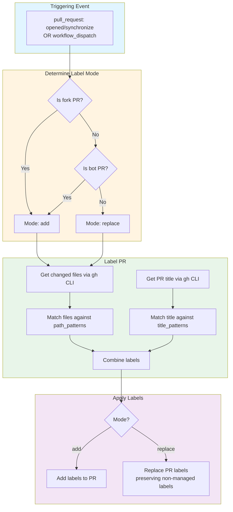

# Label PRs

Reusable workflow that automatically labels pull requests based on changed file paths and PR title patterns (conventional commit format). It uses a JSON configuration file to define labeling rules, supporting both "add" and "replace" modes for flexible label management.

## Key Features

- **File path matching**: Labels PRs based on which files were changed, using prefix-based patterns with `.gitignore`-style negation support.
- **Title pattern matching**: Labels PRs based on conventional commit prefixes in the PR title (e.g., `feat:`, `fix:`, `docs:`).
- **Two labeling modes**: "Add" mode appends labels without removing existing ones; "Replace" mode sets labels to exactly match the computed set while preserving non-managed labels.
- **Bot and fork awareness**: Automatically uses "add" mode for bot-authored and fork PRs to avoid overwriting labels set by other automations.
- **Dry run support**: Test labeling behavior without actually applying labels via `workflow_dispatch`.

## How To Use It

### Setup

1. Copy the `sdlc-label-pr.yml` workflow template into your repository's `.github/workflows/` directory.
2. Create a `.github/label-pr.json` configuration file in your repository defining `title_patterns` and `path_patterns`. See [example_label-pr.json](./example_label-pr.json) for a reference configuration.
3. Copy the `label-pr.py` script into your repository's `.github/label-prs/` directory.

### Configuration

The `label-pr.json` config file has two sections:

**`title_patterns`** — Maps label names to arrays of conventional commit prefixes:

```json
{
  "title_patterns": {
    "t:feature": ["feat", "feature"],
    "t:bug": ["fix", "bug"],
    "t:tech-debt": ["refactor", "chore"]
  }
}
```

Patterns match when the PR title contains `<pattern>:` or `<pattern>(` (case-insensitive).

**`path_patterns`** — Maps label names to arrays of file path prefixes:

```json
{
  "path_patterns": {
    "app:shared": ["core/", "data/"],
    "t:ci": [".github/", "scripts/"]
  }
}
```

Negation patterns (prefixed with `!`) exclude previously matched files, evaluated in order like `.gitignore`.

### Usage

The workflow triggers automatically on `pull_request` events (`opened`, `synchronize`). It can also be triggered manually via `workflow_dispatch` with the following inputs:

| Input       | Type    | Default | Description                          |
| ----------- | ------- | ------- | ------------------------------------ |
| `pr-number` | number  | —       | Pull request number to label         |
| `mode`      | choice  | `add`   | Labeling mode: `add` or `replace`    |
| `dry-run`   | boolean | `false` | Run without actually applying labels |

### Label Modes

- **Add** (default for bot/fork PRs): Appends computed labels to the PR without removing any existing labels.
- **Replace** (default for normal PRs): Sets the PR labels to the computed set, while preserving any labels that don't start with `app:` or `t:` prefixes.

## Workflow Diagram



## Requirements

- Python 3.9+
- GitHub CLI (`gh`) available in the runner environment
- A `.github/label-pr.json` configuration file in the repository
- Labels referenced in the config must exist in the repository

### GitHub Permissions

| Permission      | Access | Reason                        |
| --------------- | ------ | ----------------------------- |
| `pull-requests` | write  | Add or replace labels on PRs  |
| `contents`      | read   | Check out repository contents |

## Troubleshooting

### "Config file not found" error
- Verify that `.github/label-pr.json` exists in your repository
- If using a custom config path, ensure the `--config` argument is correct

### No labels applied
- Check that your `label-pr.json` patterns match the changed files or PR title
- Title patterns require a `:` or `(` suffix (e.g., `feat:` or `feat(scope)`)
- Path patterns use prefix matching — ensure paths in config end with `/` for directories
- Use `workflow_dispatch` with `dry-run: true` to debug pattern matching

### Labels not replaced as expected
- Labels without `app:` or `t:` prefixes are always preserved in replace mode
- Fork and bot PRs default to "add" mode regardless of computed mode
