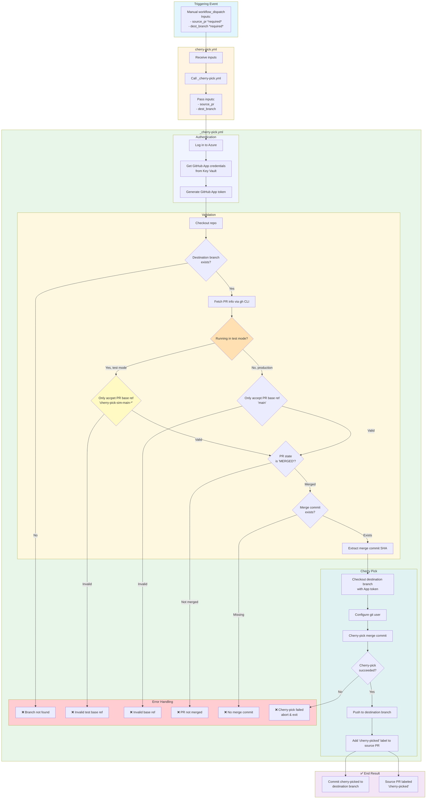

# Cherry-pick Reusable Workflow

## Description
The `cherry-pick.yml` provides an automated, on-demand way to cherry-pick commits from merged PRs into destination branches (typically `rc` or `hotfix-rc` branches). This workflow is triggered via `workflow_dispatch`, allowing you to specify which PR to cherry-pick and where to cherry-pick it to.

## Key Features
- **Manual Control**: Trigger cherry-picks on-demand via a GitHub workflow run
- **Configurable Destination Branches**: Allow cherry-picking to any branch, or restrict to specific allow-listed branches
- **Automatic Labeling**: Successfully cherry-picked PRs are automatically labeled with `cherry-picked`
- **Validation**: Ensures source PR is merged to `main` and destination branch exists

## How to use it

### Setup
1. Copy the `cherry-pick.yml` workflow template into your repository's `.github/workflows/` directory
2. Update `cherry-pick.yml` with either `string` or `choice` input for the `dest_branch` input. Remove the other type from the yaml.

### Usage
1. Navigate to **Actions** → **Automated cherry pick** in your repository
2. Click **Run workflow**
3. Enter the required inputs:
   - **Pull request to cherry pick from**: The PR number (e.g., `123`)
   - **Destination branch to cherry pick to**: The target branch name (e.g., `rc-2024-01`)
4. Click **Run workflow**

The workflow will:
1. Validate that the source PR is merged to `main`
2. Validate that the destination branch exists
3. Cherry-pick the merge commit to the destination branch
4. Push the changes directly to the destination branch
5. Add the `cherry-picked` label to the source PR

## Workflow Diagram

## Requirements
- source PR must already be merged into `main`
- source PR must have been squash merged
- destination branch must already exist
- the `cherry-pick` label must exist in the repo

## Troubleshooting

### "Could not find destination branch" error
- Verify the destination branch name is spelled correctly
- Ensure the branch exists in the repository
- Branch names are case-sensitive

### "Invalid PR base ref" error
- The source PR must have `main` as its base branch
- PRs targeting other branches cannot be cherry-picked with this workflow

### "PR not merged" error
- The PR must be in `MERGED` state
- Closed (but not merged) PRs cannot be cherry-picked
- Wait for the PR to be fully merged before triggering the workflow

### Cherry-pick failed with conflicts
- The workflow will abort and exit with an error.
- You'll need to resolve conflicts manually:
  1. Check out the destination branch locally
  2. Cherry-pick the commit manually: `git cherry-pick <commit-sha>`
  3. Resolve conflicts
  4. Push your changes
  5. Open a PR

### "Failed to add label" warning
- This is a non-fatal error
- The cherry-pick succeeded, but labeling the PR failed
- You can manually add the `cherry-picked` label if needed
- Check that repo has the `cherry-pick` label created

## Testing

The workflow includes a test workflow at `.github/workflows/test-cherry-pick.yml` that:
1. Creates simulated branches and a test PR
2. Merges the test PR
3. Calls `_cherry-pick.yml` to cherry-pick the commit
4. Cleans up all test resources

This test workflow can be triggered via `workflow_dispatch` or automatically runs on changes to the `_cherry-pick.yml` reusable workflow.
