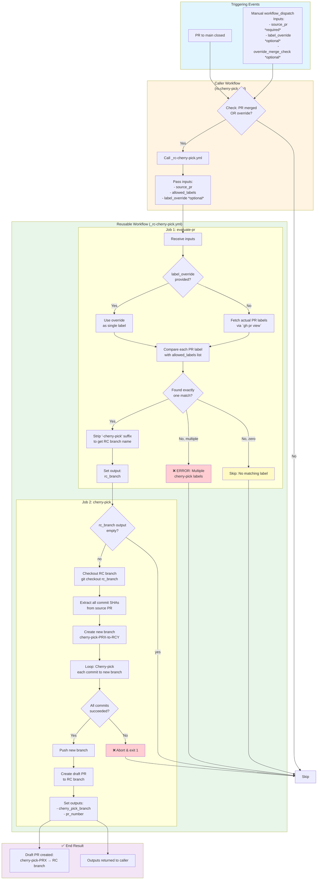

# RC Cherry-pick Reusable Workflow

## Description
The `rc-cherry-pick.yml` and `_rc-cherry-pick.yml` workflows automate the process of cherry-picking commits from merged PRs into RC branches. When a PR is merged to main with a label like `rc-cherry-pick` or `hotfix-rc-cherry-pick`, the workflow automatically extracts all commits, cherry-picks them to the corresponding RC branch, and opens a draft PR for review.

## How to use it
1. Copy the `rc-cherry-pick.yml` workflow (not `_rc-cherry-pick.yml`) into the repo you want to perform the cherry-picking in
2. Create labels in the repo for each RC branch you want to cherry pick to. The labels should use the following syntax:
```
# syntax
<rc_branch_name>-cherry-pick

# example: will cherry-pick from main -> rc-hotfix
rc-hotfix-cherry-pick

# example: will cherry-pick from main -> rc
rc-cherry-pick
```

3. Update the `allowed_labels` input parameter in your repo's copy of `rc-cherry-pick.yml` to include all labels that should trigger the cherry-pick process. This parameter should be in the JSON list format. For example:
        
```
allowed_labels: '["rc-cherry-pick", "hotfix-rc-cherry-pick"]'
```
4. And that's it. Now whenever a PR  with an applicable label is merged into `main`, the `rc-cherry-pick.yml` in your repo will call the reusable `_rc-cherry-pick.yml` workflow, and the cherry-pick process will be triggered!


## Workflow Diagram


## Troubleshooting

### The workflow didn't trigger after merging my PR
- Verify the PR was merged to `main`, not just closed
- Check that the PR has exactly one allowed label
- Ensure the label exists in your `allowed_labels` list

### Cherry-pick failed with conflicts
- The workflow will create a failed draft PR
- Resolve conflicts manually on the cherry-pick branch
- Push your changes to update the PR

### "Multiple cherry-pick labels found..." error
- Only one cherry-pick label is allowed per PR
- Remove extra labels and re-run via workflow_dispatch
