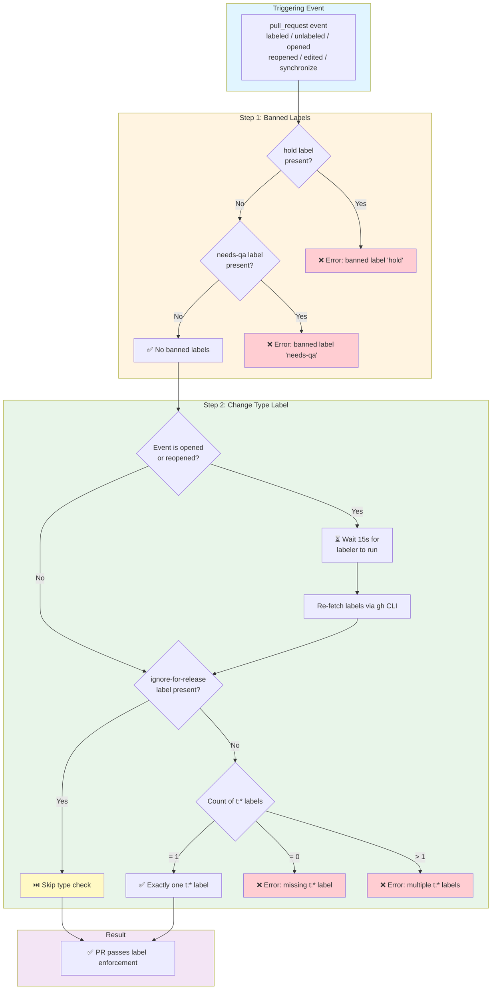

# Enforce PR Labels SDLC Reusable Workflow

## Description
The `_enforce-pr-labels-sdlc.yml` reusable workflow enforces labeling requirements on pull requests as part of the SDLC process. It triggers automatically on PR label changes and other PR events to ensure every PR has exactly one Change Type (`t:*`) label and does not carry any banned labels (e.g. `hold`, `needs-qa`).

## Key Features
- **Banned Label Enforcement**: Fails immediately if `hold` or `needs-qa` labels are present on the PR
- **Change Type Enforcement**: Ensures every PR has exactly one `t:*` label before merging
- **Labeler Grace Period**: On `opened`/`reopened` events, waits 15 seconds for automated labelers to apply labels before checking
- **Release Escape Hatch**: PRs labeled `ignore-for-release` skip the Change Type check entirely
- **Automatic Triggering**: Runs on all relevant PR events: `labeled`, `unlabeled`, `opened`, `reopened`, `edited`, `synchronize`

## How to use it

### Setup
Copy the following caller workflow into your repository's `.github/workflows/` directory and call the reusable workflow:

```yaml
name: SDLC / Enforce PR labels
run-name: Enforce labels for PR ${{ github.event.pull_request.number }}

on:
  pull_request:
    types: [labeled, unlabeled, opened, reopened, edited, synchronize]

permissions: {}

jobs:
  enforce-label:
    uses: bitwarden/gh-actions/.github/workflows/_enforce-pr-labels-sdlc.yml@main
    permissions:
      pull-requests: read
```

### Label Requirements
For a PR to pass this check, it must:
1. **Not** have the `hold` label
2. **Not** have the `needs-qa` label
3. Have **exactly one** `t:*` label (e.g. `t:bug`, `t:enhancement`, `t:refactor`)
   - Unless it has the `ignore-for-release` label, in which case the `t:*` check is skipped

## Workflow Diagram


## Requirements
- The repository must have `t:*` labels created (e.g. `t:bug`, `t:enhancement`, `t:refactor`, etc.)
- PRs targeting release/hotfix flows that should bypass type checking must use the `ignore-for-release` label

## Troubleshooting

### "PR has banned label: hold" error
- The `hold` label must be removed before the PR can be merged
- This label is typically applied to signal that a PR should not be merged yet
- Remove the label once the hold condition is resolved

### "PR has banned label: needs-qa" error
- The `needs-qa` label must be removed before the PR can be merged
- Ensure QA sign-off has been completed and the label has been removed

### "PR is missing a Change Type (t:*) label" error
- Add exactly one `t:*` label to the PR (e.g. `t:bug`, `t:enhancement`)
- On `opened`/`reopened` events the workflow waits 15 seconds for an automated labeler — if the labeler did not apply a label, add one manually
- If the PR should be excluded from release tracking entirely, add the `ignore-for-release` label

### "PR has N Change Type (t:*) labels" error
- Remove extra `t:*` labels until exactly one remains
- Each PR should represent one type of change
