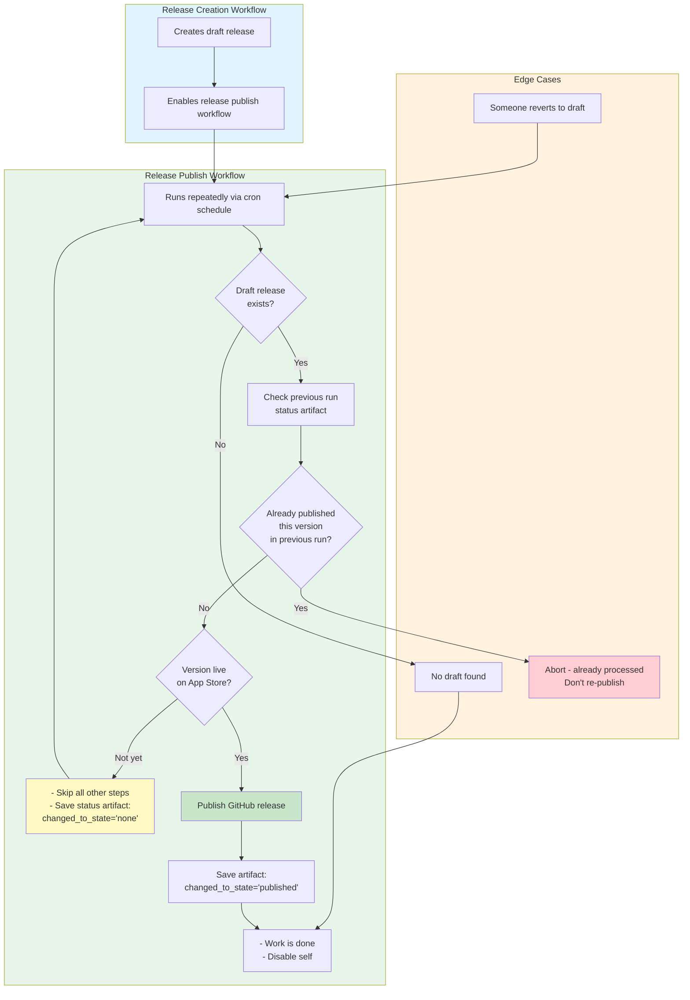

# Publish Mobile GitHub Release Reusable Workflow

## Description
The `_publish-mobile-github-release.yml` provides an automated way to publish GitHub draft releases when the corresponding mobile app version has been released to the App Store or Google Play Store. This workflow runs on a schedule to periodically check if draft releases should be published, ensuring that GitHub releases stay in sync with actual store releases.

## Key Features
- **Automated Publishing**: Automatically publishes draft GitHub releases when versions are live in app stores
- **State Tracking**: Uses artifacts to track release state and prevent duplicate processing
- **Store Version Verification**: Validates that the version is actually released on the store before publishing
- **Self-Disabling**: Automatically disables the workflow after successful publish to prevent unnecessary runs
- **Duplicate Prevention**: Tracks previously processed releases to avoid re-publishing manually reverted drafts
- **Dry Run Mode**: Supports testing without making actual changes
- **Flexible Store Integration**: Works with both iOS (App Store) and Android (Google Play) using custom verification commands

## How to use it

### Setup
1. Create a caller workflow in your repository's `.github/workflows/` directory (e.g., `publish-github-release-bwpm.yml`)
2. Configure the required inputs:
   - `release_name`: Name prefix to search for in draft releases (e.g., "Password Manager")
   - `workflow_name`: Name of the caller workflow file (for self-disabling functionality)
   - `credentials_filename`: Name of credentials file in Azure Blob Storage
   - `check_release_command`: Shell command to verify store version (must use `$CREDENTIALS_PATH` variable)
   - `project_type`: Either "ios" or "android"
   - `make_latest`: Whether to mark the release as the latest release
3. Set up required Azure secrets for credential retrieval:
   - `AZURE_SUBSCRIPTION_ID`
   - `AZURE_TENANT_ID`
   - `AZURE_CLIENT_ID`
4. Configure a schedule (typically hourly on weekdays) or use `workflow_dispatch` for manual runs

### Usage

#### Automated (Scheduled)
The workflow runs automatically on its configured schedule:
1. Checks for draft releases matching the `release_name` prefix
2. If a draft is found, downloads credentials from Azure Blob Storage
3. Runs the `check_release_command` to verify the version is live in the store
4. Compares the draft release version with the store version
5. If versions match, publishes the GitHub release (makes it non-draft and non-prerelease)
6. Disables the workflow to prevent future runs
7. Creates an artifact tracking the release state for future reference

#### Manual
1. Navigate to **Actions** → your publish workflow in your repository
2. Click **Run workflow**
3. Optionally enable **dry_run** to test without making changes
4. Click **Run workflow**

### Example Configuration

```yaml
name: Publish Password Manager GitHub Release
on:
  workflow_dispatch:
  schedule:
    - cron: '0 * * * 1-5' # Every hour on weekdays

jobs:
  publish-release:
    uses: bitwarden/gh-actions/.github/workflows/_publish-mobile-github-release.yml@main
    with:
      release_name: "Password Manager"
      workflow_name: "publish-github-release-bwpm.yml"
      credentials_filename: "appstoreconnect-fastlane.json"
      project_type: ios
      check_release_command: >
        bundle exec fastlane ios get_latest_version
        api_key_path:$CREDENTIALS_PATH
        app_identifier:com.8bit.bitwarden
      make_latest: true
    secrets: inherit
```

## Workflow Diagram


## Requirements

### Repository Requirements
- Draft GitHub releases must follow a naming pattern that includes the `release_name` (e.g., "Password Manager v2024.1.0 (123)")
- Workflow must have `contents: write`, `id-token: write`, and `actions: write` permissions

### Azure Requirements
- Azure Blob Storage account with credentials file
- OIDC federation configured for GitHub Actions
- Secrets configured:
  - `AZURE_SUBSCRIPTION_ID`
  - `AZURE_TENANT_ID`
  - `AZURE_CLIENT_ID`

### Fastlane Requirements
- Ruby and bundler available in the runner
- Fastlane configured with custom lanes for version checking
- Custom `check_release_command` must output version info in the expected format:
  ```
  version_name: 2024.1.0
  version_number: 123
  ```

### Artifact Storage
- Previous workflow runs must retain artifacts for state tracking
- Artifact retention period should be sufficient for your release cadence

## Troubleshooting

### "No draft found" - Workflow disables itself
- Verify a draft release exists in the repository
- Check that the release name contains the configured `release_name` prefix
- Ensure the release is still in draft state (not already published)
- The workflow automatically disables itself when no draft is found to prevent unnecessary runs

### "Already processed" error
This occurs when the workflow detects it already published this release:
- The release was likely published, then manually reverted to draft
- To force reprocessing:
  - Use manual `workflow_dispatch` trigger (bypasses this check)
  - OR create a new release version
- This protection prevents accidental duplicate publishing

### Version mismatch - Release not published
The draft version doesn't match the store version:
- **For iOS**: Both `version_name` and `version_number` must match
- **For Android**: Only `version_number` must match
- Possible causes:
  - App version not yet live in the store
  - App review still in progress
  - Different version uploaded to the store than in the draft
  - `check_release_command` not returning expected format
- The workflow will skip and retry on the next scheduled run

### Fastlane command fails
- Verify the credentials file exists in Azure Blob Storage with the exact filename
- Check that the credentials file has not expired
- Ensure the `check_release_command` is correctly formatted
- Test the fastlane command locally with the same credentials
- Verify the fastlane lane exists and returns the expected output format

### Artifact download fails
- Previous run may not have completed successfully
- Artifact may have been deleted or expired
- Workflow will continue without previous state (may re-process releases)
- This is a non-fatal error with a warning

### Workflow not disabling after publish
- Check the `dry_run` input - workflow won't disable in dry run mode
- Verify the workflow has `actions: write` permission
- Check that `workflow_name` input exactly matches the filename of the caller workflow
- Manual runs still work even if auto-disable fails

### Wrong release published
- Check that `release_name` filter is specific enough
- The workflow publishes the **first** draft matching the name pattern
- Consider using more specific release naming conventions

## State Artifact Schema

The workflow creates a `release-info.json` artifact to track state across runs:

```json
{
  "release_tag": "2024.1.0",
  "initial_state": "draft",
  "changed_to_state": "published"
}
```

**Fields:**
- `release_tag`: Version of the release that was processed
- `initial_state`: State when workflow started (`draft` or `published`)
- `changed_to_state`: State after workflow finished (`published`, `none`)

This artifact is stored with a name like `release-info-password-manager` (based on the `release_name` input) and is used to prevent duplicate processing.
